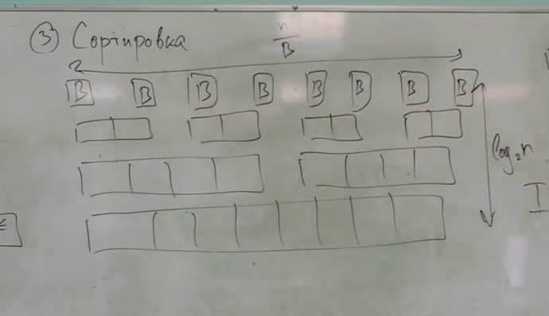

# Внешняя память

Почему мы говорим внезапно посреди лекций про нее?

Мотивация: Мы жили в RAM - модели, которая делает все за O(1). По жизни все сложнее. В RAM у нас 10-100GB. Примерно 200 тактов, чтобы обратиться к ним. Скорость примерно 5-10 GB/s.

Есть HDD. Примерно 1/120 секунды, чтобы обратиться к нему. Разница колоссальная. Скорость примерно 100-200 MB/s.

> П: Ну вы все, что вам Скаков рассказывал про HDD фигня. На самом деле там хомяк такой сидит он там крутится и арифметику считает. Вы ему говорите 2+3, хомяк там подумает-подумает и выдает ответ. 

В оперативке нам помогает кеш.

## Модель внешней памяти

Что у нас есть:

- \\( M \\) - размер RAM

- \\( N \\) - размер внешней памяти(EXT MeM)

- \\( B \\) - кусок размера B, который мы может перетащить из RAM в EXT MeM

Как мы будем оценивать?

Мы будем оценивать количество взаимодействий с памятью: **IO complexity**

Мы не будем думать о работе процессора. Грубо говоря наш процессор супер крутой, мы будем думать только о взаимодействии с памятью.

Input и Output у нас находятся на диске. 

## Примеры

> П: Есть крутой лектор: Максим Бабенко

### Сумма массива.

Дан массив n чисел. Хотим посчитать сумму. Очевидно асимптотика  \\( \frac n B \\) вверх = Scan(n). 

Считаем, что 1 число - 1 ячейка памяти. Считаем b чисел, потом следующие и так далее. И за O(1) выводим на диск сумму.

### Мерджим 2 массива.

Дано 2 отсортированных массива длины n, m.

O(Scan(n) + Scan(m)) с помощью двух указателей.

### Сортировка 

Сделаем merge sort. Возьмем куски размера B отсортируем и начнем делать merge. Очевидная идея отрабатывает за:

\\( O(\frac n b \log_2 \frac n b ) \\)

Но это медленно, мы можем быстрее. Давайте будем делиться на больше частей

Слить k массивов будет стоить (k+1)B памяти, так как у нас оперативка M, то \\( k = \frac M b\\). Поэтому на самом деле у нас дерево не двоичное в сортировке, а k-ичное. Поэтому можно делать быстрее.

\\( O(\frac n vb \log_{\frac M b} \frac n  B)  = Sort(n) \\)

